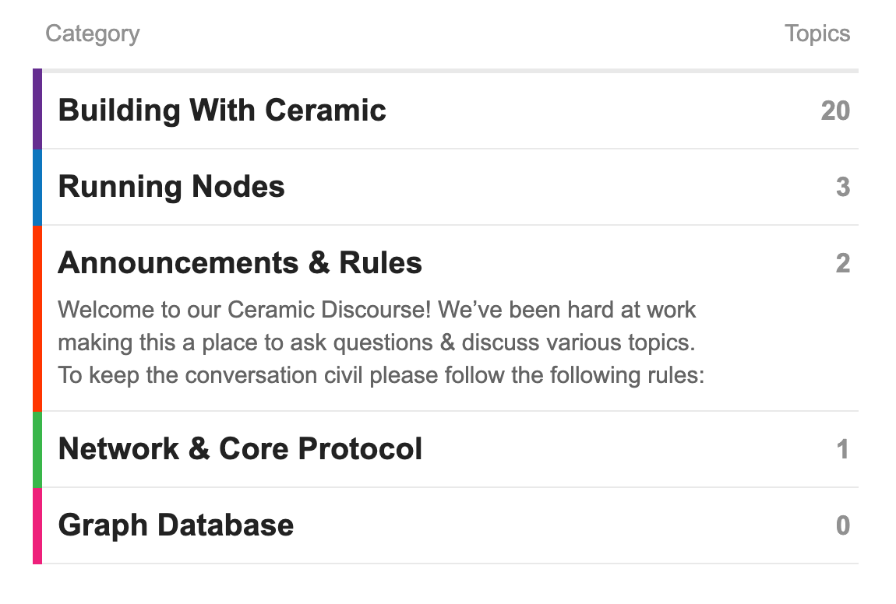

# Ceramic 推出社区论坛

*在这里，您提出技术问题并得到核心团队和社区的答复。*

:::info

原文链接：**[Ceramic Launches Community Forum](https://blog.ceramic.network/ceramic-launches-community-forum/)**

原文更新时间：2022年8月10日

原作者：KAIT HOBSON

:::

我们很高兴地与大家分享，我们推出了 [Ceramic 社区论坛](https://forum.ceramic.network/)！本论坛是提出技术问题并从社区成员和 Ceramic 核心团队处获得支持的地方。

## 我们为什么推出论坛？

如果你已经加入 Ceramic 开发者社区一段时间，你可能知道我们一直在 [Ceramic Discord 服务器](https://chat.ceramic.network/)上交流知识和接收 Ceramic 核心团队的更新。我们从许多社区成员那里收到一条反馈：随着时间的推移，Discord 的类似 RSS feed 的性质使得获取技术问题的答案和搜索信息很困难。很明显，我们需要一个更好的平台来促进技术支持，让我们的开发者社区能够分享关于 Ceramic 的技术知识。

## 我用论坛做些什么？

本论坛致力于询问和回答有关 Ceramic 的技术问题。它由几个主要类别(category)组成，专门讨论 Ceramic 技术的具体方面。如果您有问题要问，只需在最相关的类别下提出它。论坛上提出的问题将得到 Ceramic 社区和 Ceramic 的核心团队的解答。

本论坛包括一些额外的功能，可以改善整个 Ceramic 开发者社区的技术信息共享和问答：

- 更好的搜索——您可以使用论坛的内置搜索工具来发现可能与您的问题相似的问题。

- 使用以太坊登录——您可以使用您的以太坊钱包进行注册以开始使用论坛。

## 那么 Ceramic Discord 服务器呢？

Ceramic Discord 服务器不会消失。展望未来，该服务器将专注于促进围绕 Ceramic 的更高层次的讨论——例如谈论社区项目，分享关于 Ceramic 网络的想法和具体方面的反馈。在接下来的一个月里，随着我们将技术支持转移到 Ceramic 论坛，预计 Discord 服务器将发生一些架构变化。

试用一下 Ceramic 论坛，让我们知道你的想法！